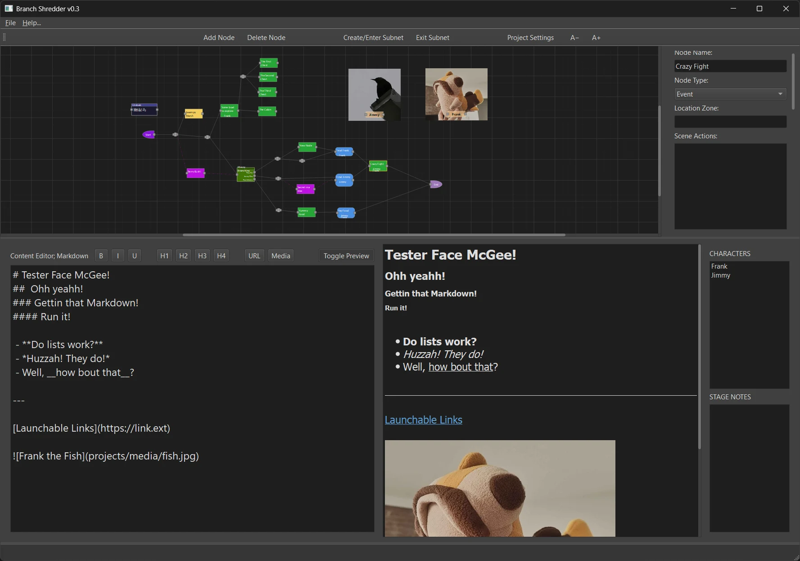
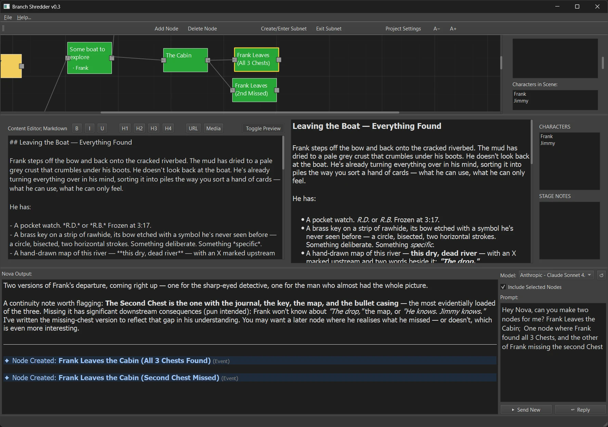

# Branch Shredder v0.3
### Visualize branching narratives with ease
#### Built by Kevin Edzenga; gh - ProcStack
<br/> 

### Features -
Build out a node graph of your dialogue choices, taking different actions in your story, and connect your nodes to easly know what story elements connect to what other story elements.

With a built in text editor with Markdown Language suppport, easly add Links & Images to each area of your story.

Have any key art you want to help distinguish different characters or story arc events?
<br/>Add the images from your computer and you can then select an image to display around the node as a "background image"
<br/><br/>



### Functionality -
 - Move Nodes -- Left Click + Drag Node
 - Pan Scene -- Left Click + Drag Empty Area
 - Zoom Scene -- Right Click + Drag
 - Create Node -- Left Click -or- Drag line out from a Socket & Release
 - Select Node / Connection Line -- Left Click
 - Select Multiple Nodes -- Shift + Left Click -or- Shift + Drag Empty Area
 - Delete Selected Node/Connection -- Delete Key
<br/><br/>
 - Reconnect Nodes -- Click+Drag on Connected Socket
 - Disconnect all connections on selected node -- Press `Y`
<br/><br/>
 - Insert Dot on Connection -- Double Click on Connection Line
 - Insert Node on Connection -- Drag+Drop Node onto Connection Line
<br/><br/>
 - Create / Enter Subnetwork -- Double Click on Node -or- Click 'Create/Enter Subnet' -or- Press `I` with selected Subnetwork
 - Exit Subnetwork -- Click 'Exit Subnet' -or- Press `U`


<br/>
---

### Installation -

**Python 3.10+** is required.

REQUIRED - Install all core dependencies (PyQt6 + optional cloud AI providers):
```
pip install -r requirements.txt
```

OPTIONAL - Install local-to-computer LLM dependencies only (To use Llama):
```
pip install -r requirements_localLLM.txt
```

To run:
```
python branchShredder.py
```

---



### AI Assistant `Nova` -

I've included an AI assist I named `Nova` to help with suggestions, finding continuity issues, and to make new nodes with written content.

I made the chioce to add AI since this does seem like a type of thing that could help writer's block.  
So I figured having the option to use an AI in the interface might be helpful.

<br/>However, it's up to you to turn on the AI Prompt in your Project Settings.
<br/> **`Project Settings > AI Assistant > Show AI Prompt Bar`**
<br/>The AI Prompt bar will appear at the bottom of your window.

You have API access to OpenAI's ChatGPT, Anthropic's Claude, X's Groq, Google's Gemini & Meta's Llama.
<br/>Of these, Llama can be downloaded and ran on your computer locally.
<br/>This means none of your story is sent to some server or used to train llms, when using Llama.
<br/>So if you're weary of using ai to help you write, because it trains off your work, you have an option to avoid that.

If you choose to use Llama, it will automatically download for you once you select the model you want to download and use.

When prompting, use the "Include Selected Nodes" toggle to send the content of those selected node with the LLM prompt.
The LLM will be able to understand the flow of your nodes, type of nodes, characters associated, and the writing itself.
This also allowing the LLM to spot continuity issues between different branching events.

#### Cloud AI Providers

Add API keys to a `.env` file in the project root (copy `.env.example` as a starting point):
```
OPENAI_API_KEY=sk-...
ANTHROPIC_API_KEY=sk-ant-...
GROQ_API_KEY=gsk_...
GOOGLE_API_KEY=...
```

| Provider | Models | Get a key |
|---|---|---|
| OpenAI | GPT-4o, GPT-4o Mini, GPT-4 Turbo, GPT-3.5 Turbo | https://platform.openai.com/api-keys |
| Anthropic | Claude 3.5 Sonnet/Haiku, Claude 3 Opus | https://console.anthropic.com/settings/keys |
| Groq | Llama 3.3 70B, Llama 3.1 8B, Mixtral, Gemma 2 | https://console.groq.com/keys |
| Google | Gemini 2.0 Flash, 1.5 Pro/Flash | https://aistudio.google.com/app/apikey |

After adding or editing keys, click the **↺** button in the AI Prompt Bar to reload the keys.

> **Groq** offers a free tier and is a good option if you have no existing API accounts.
> But there is local LLM support, see below

#### Project AI Context

In **Project Settings > AI Assistant > Project AI Context**, describe your story's world, tone, genre, and main characters. This text is appended to every AI query as additional system context so responses stay relevant to your project.

---

### Local LLM Support (no API key required) -

You can run Llama models entirely offline.
Models are downloaded from Hugging Face Hub and stored in the `models` folder.

#### 1. Install local LLM dependencies

```
pip install -r requirements_localLLM.txt
```

> **Windows note:** `llama-cpp-python` is used to compile native C++ code. If you don't have Visual C++ Build Tools installed, use a pre-built CPU wheel instead:
> ```
> pip install llama-cpp-python --extra-index-url https://abetlen.github.io/llama-cpp-python/whl/cpu
> ```

#### 2. GPU acceleration (optional - CUDA)

If you have an NVIDIA GPU and want faster inference:
```
set CMAKE_ARGS=-DGGML_CUDA=on
pip install llama-cpp-python --no-cache-dir --force-reinstall
```

#### 3. Download a model

In the AI Prompt Bar, select **"↓ Download a Llama model…"** from the model dropdown. A dialog will list all available models with their download sizes. Select one and click **Download Selected**.

Available models include:
 - Llama 3.2 - 1B, 3B
 - Llama 3.1 - 8B, 70B
 - Llama 3 - 8B, 70B
 - Llama 2 - 7B, 13B, 70B
 - CodeLlama - 7B, 13B, 34B


Once downloaded the model will appear in the dropdown automatically. Models are cached in `models/` and only need to be downloaded once.

<br/>
