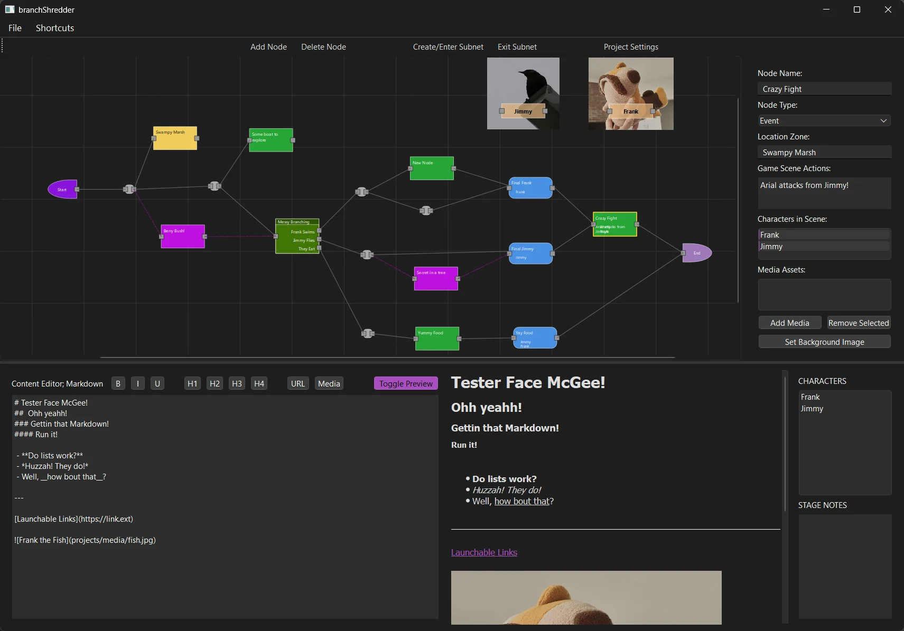

# Branch Shredder v0.1
### Visualize branching narratives with ease
#### Built by Kevin Edzenga; gh - ProcStack

### Features -
Build out a node graph of your dialogue choices, taking different actions in your story, and connect your nodes to easly know what story elements connect to what other story elements.

With a built in text editor with Markdown Language suppport, easly add Links & Images to each area of your story.

Have any key art you want to help distinguish different characters or story arc events?
 Add the images from your computer and you can then select an image to display around the node as a "background image"

### Functionality -
 - Move Nodes -- Left Click + Drag Node
 - Pan Scene -- Left Click + Drag Empty Area
 - Zoom Scene -- Right Click + Drag
 - Create Node -- Left Click -or- Drag line out from a Socket & Release
 - Select Node / Connection Line -- Left Click
 - Delete Selected Node/Connection -- Delete Key
  
 - Reconnect Nodes -- Click+Drag on Connected Socket
 - Disconnect all connections on selected node -- Press `Y`
  
 - Insert Dot on Connection -- Double Click on Connection Line
 - Insert Node on Connection -- Drag+Drop Node onto Connection Line
  
 - Create / Enter Subnetwork -- Double Click on Node -or- Click 'Create/Enter Subnet' -or- Press `I` with selected Subnetwork
 - Exit Subnetwork -- Click 'Exit Subnet' -or- Press `U`

 
